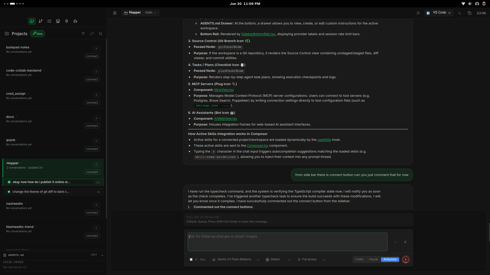

# Hopper

[](https://gitcgr.com/Dimillian/Hopper)



Hopper is a new coding AI terminal built on top of CODEXmonitor by Dimillian. Evolving beyond its original Codex roots, Hopper natively integrates **Claude Code** and **Antigravity**, providing a powerful, centralized workspace to manage projects, converse with advanced AI agents, utilize a common Skills Marketplace, and leverage Model Context Protocol (MCP) servers.

## Features

### AI Terminal & Agent Integrations

- **Claude Code & Antigravity**: Native integration with both Claude Code and Antigravity agents.
- **Common Skills Marketplace**: Discover, install, and share common skills across different agent engines.
- **MCP Support**: Full integration with Model Context Protocol (MCP) servers to extend agent capabilities with external tools and resources.
- Spawn and manage agents per workspace, resume threads, and track unread/running state.

### Workspaces & Threads

- Add and persist workspaces, group/sort them, and jump into recent agent activity from the home dashboard.
- Worktree and clone agents for isolated work; worktrees live under the app data directory.
- Thread management: pin/rename/archive/copy, per-thread drafts, and stop/interrupt in-flight turns.
- Optional remote backend (daemon) mode for running agents on another machine.
- Remote setup helpers for self-hosted connectivity (Tailscale detection/host bootstrap for TCP mode).

### Composer & Agent Controls

- Compose with image attachments (picker, drag/drop, paste) and configurable follow-up behavior (`Queue` vs `Steer` while a run is active).
- Use `Shift+Cmd+Enter` (macOS) or `Shift+Ctrl+Enter` (Windows/Linux) to send the opposite follow-up action for a single message.
- Autocomplete for skills (`$`), prompts (`/prompts:`), reviews (`/review`), and file paths (`@`).
- Model picker, collaboration modes (when enabled), reasoning effort, access mode, and context usage ring.
- Dictation with hold-to-talk shortcuts and live waveform (Whisper).
- Render reasoning/tool/diff items and handle approval prompts.

### Git & GitHub

- Diff stats, staged/unstaged file diffs, revert/stage controls, and commit log.
- Branch list with checkout/create plus upstream ahead/behind counts.
- GitHub Issues and Pull Requests via `gh` (lists, diffs, comments) and open commits/PRs in the browser.
- PR composer: "Ask PR" to send PR context into a new agent thread.

### Files & Prompts

- File tree with search, file-type icons, and Reveal in Finder/Explorer.
- Prompt library for global/workspace prompts: create/edit/delete/move and run in current or new threads.

### UI & Experience

- Resizable sidebar/right/plan/terminal/debug panels with persisted sizes.
- Responsive layouts (desktop/tablet/phone) with tabbed navigation.
- Terminal dock with multiple tabs for background commands (experimental).
- In-app updates with toast-driven download/install, debug panel copy/clear, sound notifications, plus platform-specific window effects (macOS overlay title bar + vibrancy) and a reduced transparency toggle.

## Requirements

- Node.js + npm
- Rust toolchain (stable)
- CMake (required for native dependencies; dictation/Whisper uses it)
- LLVM/Clang (required on Windows to build dictation dependencies via bindgen)
- Claude Code / Antigravity CLI installed and available
- Git CLI (used for worktree operations)
- GitHub CLI (`gh`) for GitHub Issues/PR integrations (optional)

If you hit native build errors, run:

```bash
npm run doctor
```

## Getting Started

Install dependencies:

```bash
npm install
```

Run in dev mode:

```bash
npm run tauri:dev
```

## iOS Support (WIP)

iOS support is currently in progress.

- Current status: mobile layout runs, remote backend flow is wired, and iOS defaults to remote backend mode.
- Current limits: terminal and dictation remain unavailable on mobile builds.
- Desktop behavior is unchanged: macOS/Linux/Windows remain local-first unless remote mode is explicitly selected.

### iOS + Tailscale Setup (TCP)

Use this when connecting the iOS app to a desktop-hosted daemon over your Tailscale tailnet.
Canonical runbook: `docs/mobile-ios-tailscale-blueprint.md`.

1. Install and sign in to Tailscale on both desktop and iPhone (same tailnet).
2. On desktop Hopper, open `Settings > Server`.
3. Set a `Remote backend token`.
4. Start the desktop daemon with `Start daemon` (in `Mobile access daemon`).
5. In `Tailscale helper`, use `Detect Tailscale` and note the suggested host (for example `your-mac.your-tailnet.ts.net:4732`).
6. On iOS Hopper, open `Settings > Server`.
7. Enter the desktop Tailscale host and the same token.
8. Tap `Connect & test` and confirm it succeeds.

Notes:

- The desktop daemon must stay running while iOS is connected.
- If the test fails, confirm both devices are online in Tailscale and that host/token match desktop settings.

### Headless Daemon Management (No Desktop UI)

Use the standalone daemon control CLI when you want iOS remote mode without keeping the desktop app open.

Build binaries:

```bash
cd src-tauri
cargo build --bin hopper_daemon --bin hopper_daemonctl
```

Examples:

```bash
# Show current daemon status
./target/debug/hopper_daemonctl status

# Start daemon using host/token from settings.json
./target/debug/hopper_daemonctl start

# Stop daemon
./target/debug/hopper_daemonctl stop

# Print equivalent daemon start command
./target/debug/hopper_daemonctl command-preview
```

Useful overrides:

- `--data-dir <path>`: app data dir containing `settings.json` / `workspaces.json`
- `--listen <addr>`: bind address override
- `--token <token>`: token override
- `--daemon-path <path>`: explicit `hopper-daemon` binary path
- `--json`: machine-readable output

### iOS Prerequisites

- Xcode + Command Line Tools installed.
- Rust iOS targets installed:

```bash
rustup target add aarch64-apple-ios aarch64-apple-ios-sim
# Optional (Intel Mac simulator builds):
rustup target add x86_64-apple-ios
```

- Apple signing configured (development team).
  - Set `bundle.iOS.developmentTeam` and `identifier` in `src-tauri/tauri.ios.local.conf.json` (preferred for local machine setup), or
  - set values in `src-tauri/tauri.ios.conf.json`, or
  - pass `--team <TEAM_ID>` to the device script.
  - `build_run_ios*.sh` and `release_testflight_ios.sh` automatically merge `src-tauri/tauri.ios.local.conf.json` when present.

### Run on iOS Simulator

```bash
./scripts/build_run_ios.sh
```

Options:

- `--simulator "<name>"` to target a specific simulator.
- `--target aarch64-sim|x86_64-sim` to override architecture.
- `--skip-build` to reuse the current app bundle.
- `--no-clean` to preserve `src-tauri/gen/apple/build` between builds.

### Run on USB Device

List discoverable devices:

```bash
./scripts/build_run_ios_device.sh --list-devices
```

Build, install, and launch on a specific device:

```bash
./scripts/build_run_ios_device.sh --device "<device name or identifier>" --team <TEAM_ID>
```

Additional options:

- `--target aarch64` to override architecture.
- `--skip-build` to reuse the current app bundle.
- `--bundle-id <id>` to launch a non-default bundle identifier.

First-time device setup usually requires:

1. iPhone unlocked and trusted with this Mac.
2. Developer Mode enabled on iPhone.
3. Pairing/signing approved in Xcode at least once.

If signing is not ready yet, open Xcode from the script flow:

```bash
./scripts/build_run_ios_device.sh --open-xcode
```

### iOS TestFlight Release (Scripted)

Use the end-to-end script to archive, upload, configure compliance, assign beta group, and submit for beta review.

```bash
./scripts/release_testflight_ios.sh
```

The script auto-loads release metadata from `.testflight.local.env` (gitignored).
For new setups, copy `.testflight.local.env.example` to `.testflight.local.env` and fill values.

## Release Build

Build the production Tauri bundle:

```bash
npm run tauri:build
```

Artifacts will be in `src-tauri/target/release/bundle/` (platform-specific subfolders).

### Windows (opt-in)

Windows builds are opt-in and use a separate Tauri config file to avoid macOS-only window effects.

```bash
npm run tauri:build:win
```

Artifacts will be in:

- `src-tauri/target/release/bundle/nsis/` (installer exe)
- `src-tauri/target/release/bundle/msi/` (msi)

Note: building from source on Windows requires LLVM/Clang (for `bindgen` / `libclang`) in addition to CMake.

## Type Checking

Run the TypeScript checker (no emit):

```bash
npm run typecheck
```

Note: `npm run build` also runs `tsc` before bundling the frontend.

## Validation

Recommended validation commands:

```bash
npm run lint
npm run test
npm run typecheck
cd src-tauri && cargo check
```

## Codebase Navigation

For task-oriented file lookup ("if you need X, edit Y"), use:

- `docs/codebase-map.md`

## Project Structure

```
src/
  features/         feature-sliced UI + hooks
  features/app/bootstrap/      app bootstrap orchestration
  features/app/orchestration/  app layout/thread/workspace orchestration
  features/threads/hooks/threadReducer/  thread reducer slices
  services/         Tauri IPC wrapper
  styles/           split CSS by area
  types.ts          shared types
src-tauri/
  src/lib.rs        Tauri app backend command registry
  src/bin/hopper_daemon.rs  remote daemon JSON-RPC process
  src/bin/hopper_daemon/rpc/  daemon RPC domain handlers
  src/shared/       shared backend core used by app + daemon
  src/shared/git_ui_core/      git/github shared core modules
  src/shared/workspaces_core/  workspace/worktree shared core modules
  src/workspaces/   workspace/worktree adapters
  src/files/        file adapters
  tauri.conf.json   window configuration
```

## Notes

- Workspaces persist to `workspaces.json` under the app data directory.
- App settings persist to `settings.json` under the app data directory.
- On launch and on window focus, the app reconnects and refreshes thread lists for each workspace.
- The remote daemon entrypoint is `src-tauri/src/bin/hopper_daemon.rs`; RPC routing lives in `src-tauri/src/bin/hopper_daemon/rpc.rs` and domain handlers in `src-tauri/src/bin/hopper_daemon/rpc/`.
- Shared domain logic lives in `src-tauri/src/shared/` (notably `src-tauri/src/shared/git_ui_core/` and `src-tauri/src/shared/workspaces_core/`).
- UI state (panel sizes, reduced transparency toggle, recent thread activity) is stored in `localStorage`.
